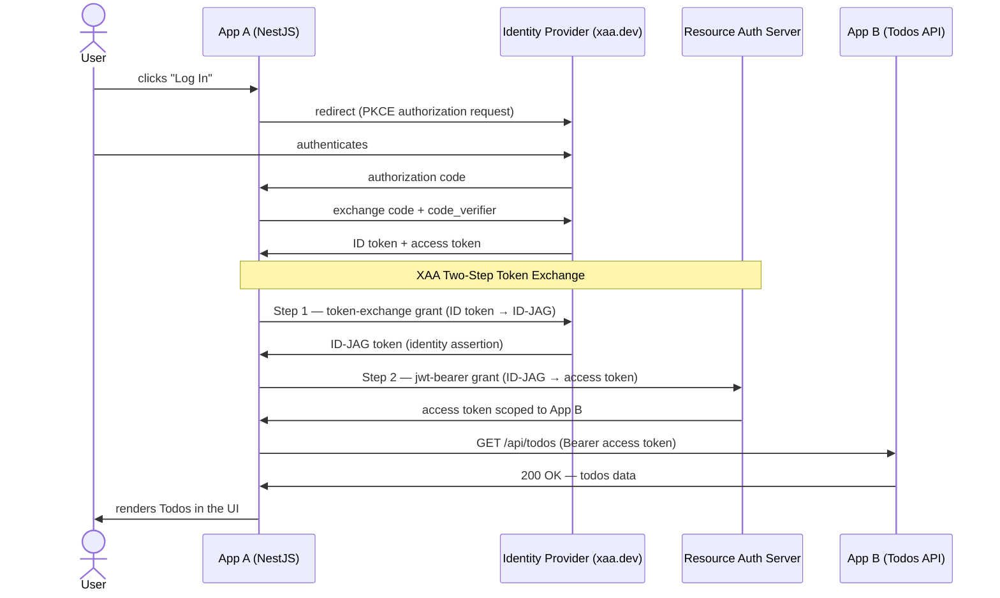

# DevConnect Workshop: Cross App Access (XAA)

Welcome! By the end, your NestJS app (App A) will be authenticating to a remote Todos API (App B) using Cross App Access (XAA) — no shared passwords, no manual credential wiring, just a clean two-step token exchange.



---

## Prerequisites

- [Node.js](https://nodejs.org/en) v22 or higher
- [VS Code](https://code.visualstudio.com/)
- [Git](https://git-scm.com/)
- [Claude Code](https://docs.anthropic.com/en/docs/claude-code) CLI — *optional, requires an Anthropic account* (`npm install -g @anthropic-ai/claude-code`)

---

## 1. Setup: Choose Your Environment

### Option A — GitHub Codespaces (recommended for workshops)

No local installs required. The Codespace pre-installs all dependencies and the CodeTour
extension automatically.

1. Open the repository on GitHub
2. Click **Code → Codespaces → Create codespace on xaa-codetour**
3. Wait for the container to build (~1 minute) — `npm ci` runs automatically
4. Once the editor loads, find your unique Codespaces URL in the **Ports** panel (the
   forwarded address for port 3000). It will look like:
   `https://<codespace-name>-3000.app.github.dev`
5. Register `https://<codespace-name>-3000.app.github.dev/auth/callback` as an allowed
   redirect URI in your [xaa.dev](https://xaa.dev/developer/register) app registration
6. Skip ahead to [Configure your credentials](#2-clone-and-configure-the-app)

---

### Option B — Local VS Code

Install the **CodeTour** extension before the session:

**Via VS Code Marketplace UI**
1. Press `Ctrl+Shift+X` (macOS: `Cmd+Shift+X`) to open the Extensions panel
2. Search for **CodeTour**
3. Click **Install** on the extension by **@vsls-contrib**

**Via terminal**
```sh
code --install-extension vsls-contrib.codetour
```

**Verify it worked:** You should see a **CODETOUR** section appear in the Explorer panel
sidebar after reloading VS Code.

---

## 2. Clone and Configure the App

**Codespaces users:** The repo is already open and `npm ci` has already run — start at the
`cp` command below.

**Local users:** Clone the repo first:
```sh
git clone https://github.com/oktadev/okta-nestjs-xaa-requestor-example.git
cd okta-nestjs-xaa-requestor-example
npm ci
```

Register your client app at **[xaa.dev/developer/register](https://xaa.dev/developer/register)**:

1. Click **Developer → Register Client → + Register New Client**
2. Fill in the form:

| Field | Value |
|---|---|
| Application Name | `Notes App` |
| Redirect URIs | `http://localhost:3000/auth/callback` (local) or your Codespaces callback URL |
| Post-Logout Redirect URIs | `http://localhost:3000` |

3. Leave all other settings as defaults and click **Register Client**
4. Copy the `client_id` and `client_secret` from the confirmation screen

Then create your `.env`:

```sh
cp .env.example .env
```

Open `.env` and fill in your credentials:

```
CLIENT_ID=<your-client-id>
CLIENT_SECRET=<your-client-secret>
```

The `IDP_URL`, `AUTH_SERVER_URL`, and `TODO_RESOURCE_SERVER` values are pre-filled and point to
the shared `xaa.dev` test environment — no changes needed.

---

## 3. Start the App

With your `.env` configured, start the server:

```sh
npm start
```

Navigate to **http://localhost:3000** (or your Codespaces preview URL) — the homepage should
load. The app is running, but the XAA token exchange methods are stubbed out so the Todos
panel won't work yet.

> **That's intentional — Step 2 of the tour is where you'll paste in the implementations.**
> Once you save the code there, restart the server and the full flow will work end-to-end.

---

## 4. Instructions: Start the XAA Workshop Tour

1. Open this project folder in VS Code (`File → Open Folder`)
2. Open the Command Palette: `Ctrl+Shift+P` (macOS: `Cmd+Shift+P`)
3. Type **CodeTour: Start Tour** and press Enter
4. Select **"XAA Workshop"** from the list

The tour opens inline, pinned to each relevant file. Use the **→ Next** button at the bottom
of each step to advance. The four stops are:

| Stop | File | What you'll see |
|------|------|-----------------|
| 1 — Introduction | `README.md` | The XAA flow end-to-end |
| 2 — Config | `.env.example` | Where your client credentials plug in |
| 3 — The Request | `src/auth/auth.service.ts` | The two-step ID-JAG token exchange |
| 4 — The Validation | `src/common/auth.guard.ts` | How the access token is enforced |

---

## 5. The Secret Weapon: Claude as Your Pair Programmer

Stuck on a step? See an error you don't recognize? **Don't wait — ask Claude.**

> **Note:** Claude Code requires a free [Anthropic account](https://console.anthropic.com/).
> If you don't have one, you can sign up during the workshop or skip this step and use the
> troubleshooting table below instead.

Each tour step includes a suggested prompt tailored to that step. To use it:

1. Open a new terminal in the project root
2. Run:
   ```sh
   claude
   ```
3. Paste the suggested prompt from the tour step, or describe what you're seeing

**Example prompts for common problems:**

| Situation | What to ask Claude |
|---|---|
| `.env` values not loading | *"My NestJS app throws 'IDP_URL must be configured' at startup. Here's my .env file — what's wrong?"* |
| Token exchange returns 401 | *"My XAA token exchange is returning a 401. Here's the request body — what scopes or parameters might be missing?"* |
| Guard always rejects requests | *"My AuthGuard throws UnauthorizedException even after login. Walk me through how the session stores the access token."* |
| Want to go deeper | *"Explain the difference between the ID-JAG token and the final access token in this XAA flow."* |

Claude Code has full context of this codebase — it can read the exact files you're looking at
and suggest targeted fixes, not generic advice.

> **Pro-Tip:** Don't spend more than 2 minutes debugging a single line. Ask Claude Code to fix
> it and move to the next step to stay on schedule!

---

## 6. Definition of Done

You've completed the workshop when you can check off all three:

- [ ] **App starts cleanly** — `npm start` runs with no errors and logs
  `Application is running on: http://localhost:3000`

- [ ] **Login works** — Navigating to `http://localhost:3000`, clicking **Log In**, and
  completing the xaa.dev login flow lands you on the `/notes` page with your email in the header

- [ ] **App B responds with 200 OK** — The right-hand **Todos** panel on the `/notes` page
  displays a list of todos fetched from App B. In your terminal you'll see the two-step
  exchange logged, ending with a line like:
  ```
  ← GET /api/todos  200 OK
  ```

If all three boxes are checked, App A is successfully authenticating to App B via XAA. That's
the full Cross App Access flow working end-to-end.

---

## Troubleshooting Quick Reference

| Error | Likely cause | Fix |
|---|---|---|
| `IDP_URL and CLIENT_ID must be configured` | `.env` file missing or not in project root | Run `cp .env.example .env` and fill in credentials |
| `401 Unauthorized` on token exchange | Wrong `CLIENT_ID` or `CLIENT_SECRET` | Re-check values from xaa.dev registration |
| Todos panel shows an error | `TODO_RESOURCE_SERVER` URL mismatch | Confirm `.env` value matches `.env.example` exactly |
| Session not persisting after login | `SESSION_SECRET` not set | Add any non-empty string as `SESSION_SECRET` in `.env` |

Still stuck? Run `claude` and describe the exact error message and which tour step you're on.

---

## Resources

- [XAA Workshop Tour](/.tours/xaa-workshop.tour) — the guided CodeTour for this project
- [Identity Assertion JWT Authorization Grant spec](https://drafts.oauth.net/oauth-identity-assertion-authz-grant/draft-ietf-oauth-identity-assertion-authz-grant.html)
- [xaa.dev](https://xaa.dev/) — test environment and client registration
- [Okta Developer Forums](https://devforum.okta.com/) — post-workshop questions
